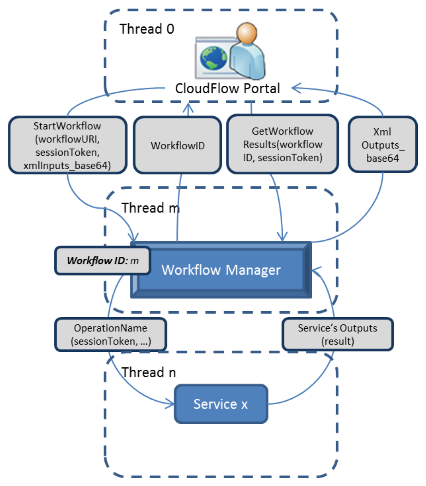

# Service types in CloudFlow
The CloudFlow infrastructure stack currently knows three types of CloudFlow
services. It is important to understand the differences between those types in
order to choose the right type for a certain use case.

_Important:_ In this document, "service" generally refers to a CloudFlow 
service rather than a webservice. A single webservice application may contain
several webmethods which can be used as different types of CloudFlow services.

## Synchronous services
Synchronous services are the simplest types of CloudFlow services. They are
wrappers of single webservice methods which, when called, do something, and
then immediately return their results. They have no limitations in their inputs
and outputs.

Synchronous services fit best for simple tasks which don't take a long time to
complete. They can be compared to simple command-line commands which take some
input and immediately return some output.

## Asynchronous services
Asynchronous services are meant for operations which take so long to process
their inputs that it's inconvenient to wait for their completion without seeing
any intermediate status reports. This can, for example, be time-consuming 
calculations or HPC jobs which might run over hours or days. Asynchronous
services are designed such that the user will regularly get status updates from
them.

## Applications
Applications are very similar to asynchronous services, but with a slightly 
different scope. While an asynchronous service runs, once started, without any
further user input (it only shows output to the user regularly), applications
are designed to interact with the user while they are being executed.
