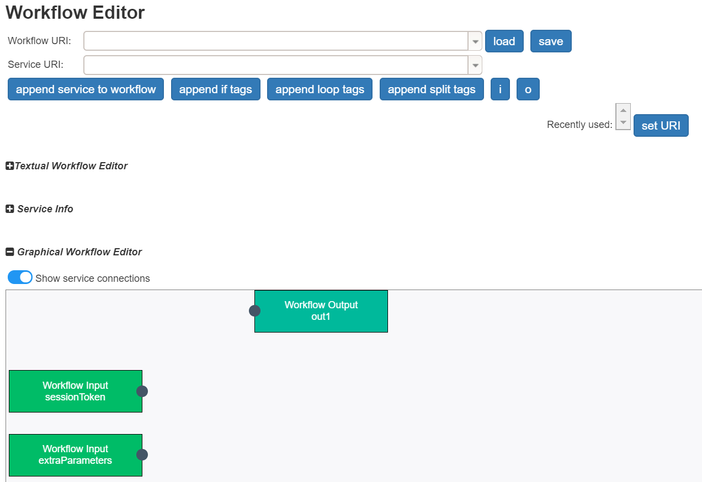
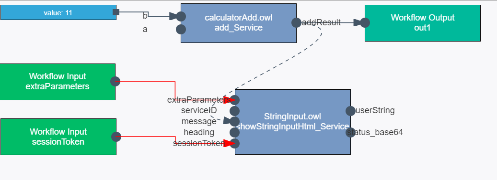
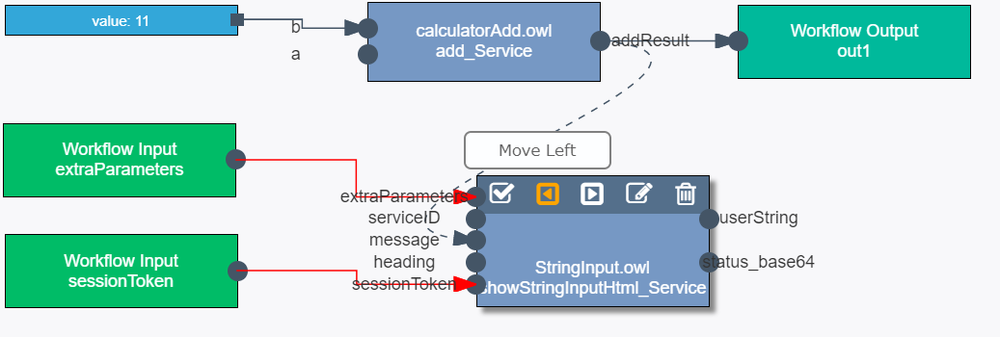
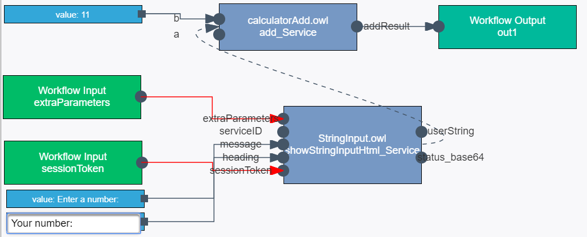
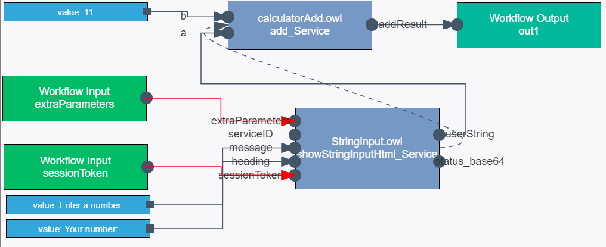

# Tutorial 2-1 - Editing workflows
In this part of the tutorial we will load a workflow, edit it, and finally save it, whereby learning the basics of the Workflow Editor.

1. To start, navigate to __WF Editor__ -> __Workflow editor__.
- The upper part of the page provides the means to add services, and to remove services and workflows.

- The lower parts feature the tools to load, edit and save workflows.
2.  Scroll down until the whole lower section is visible.

## The Workflow Editor
The Workflow Editor provides means to create sophisticated workflows:

 - The textual editor can be used to fine-tune the workflow and create more complex arrangements of services. There should be no need to consult the textual editor during the course of this tutorial, the interested users might nevertheless have a peek at the textual representation of their workflow.
 - The graphical editor provides an intuitive interface to arrange, connect and edit services.
 
## Step 1 - Load workflow

1. To load a workflow, select one from the dropdown-menu __Workflow URI__, or type the name of the desired workflow.

2. Please select the following workflow:

> http://www.caxman.eu/workflows/sintef/CalculatorAdd.owl#CalculatorAdd

3. Click on __load__ and confirm your choice.
4. Shortly afterwards, the workflow should be visible in the graphical editor. It consist of the __calculatorAdd__-service, which takes two static values as inputs. The result of the service is forwarded to a workflow output.

## Step 2 - Edit workflow
Now, we will modify the workflow by adding a new service to replace one of the static values with an input dialog. 

1. Click on one of the inputs of the __calulatorAdd__-service to remove the attached value. You can re-add it anytime, by clicking on the input again, and then on the value node to re-enter a value.

2. Select the following service from the __Service URI__ dropdown-menu:

> http://www.caxman.eu/apps/dfki/StringInput.owl#showStringInputHtml_Service

3. Click on  __append service to workflow__. Shortly afterwards the new service should appear in the graphical editor. The dotted line indicates the order of the services in your workflow. Right now, the __StringInput__ is scheduled after __calculatorAdd__. To change the order, double-click on one service and use the buttons with the arrows to modify its position within the workflow.

4. The workflow is still far from complete, you need to provide the inputs __message__ and __heading__  by clicking on their input at the __StringInput__-service. To change their values, click on the newly created nodes. Both, the heading and the message will be displayed to inform the user what kind value he should enter.

5. Finally, it remains to connect the output of the newly added service to the empty input of the __calculatorAdd__-Service. Click on the __userString__-output and drag a connection to the empty input. The __Workflow Input__  __extraParameters__ and __sessionToken__ were automatically connected to the __StringInput__-service and should remain in that state.

## Step 3 - Save workflow
1. To save the workflow, adapt its __Workflow URI__ to your liking. Do not leave it unchanged, as you will then not be able to save the workflow. The part behind the # will define the name of your workflow. It must not start with a digit, but may contain underscores (_). The part in front of the # defines the unique identifier of your workflow.

2. Once the __Workflow URI__ has been adapted, click on __save__ and confirm your choice.
3. Please wait patiently until a success message appears.