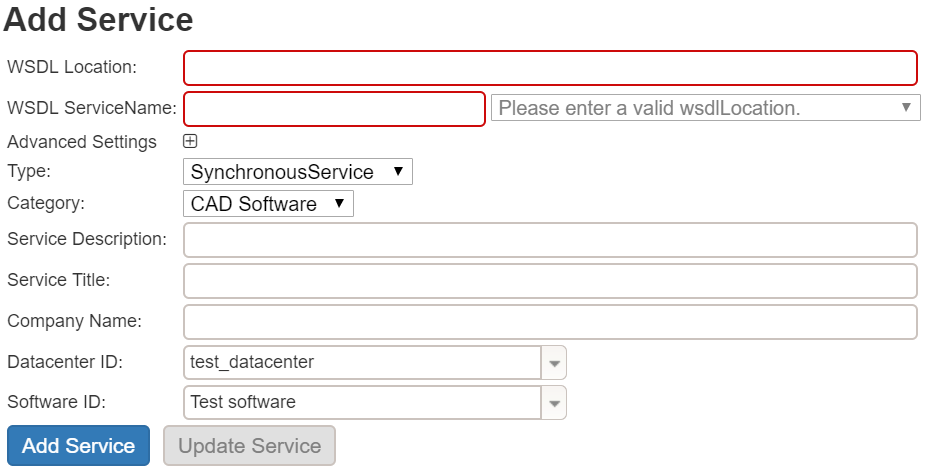
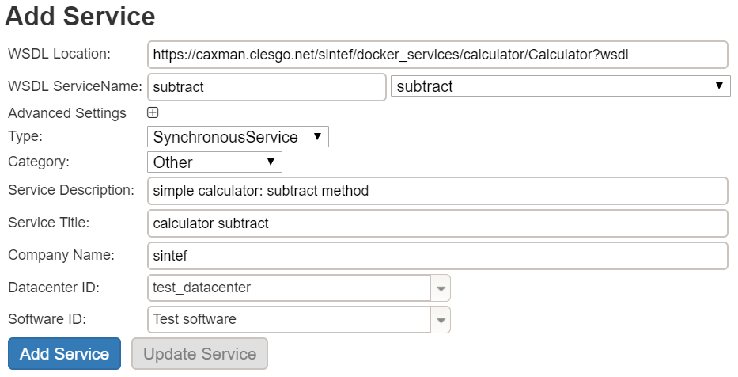

# Tutorial 2-3 - Adding services
In this final part of Level 2 we will register a new service.

1. Navigate to the Workflow Editor (__WF Editor__ -> __Workflow editor__).
2. The dialog to add new services is located at the top of the page.

3. The first and most important thing to provide is the __WSDL Location__ of the new service. For this tutorial, please enter the following URL:

> https://caxman.clesgo.net/sintef/docker_services/calculator/Calculator?wsdl

4. Once the WSDL has been loaded, select __multiply__ or __substract__ from the dropdown-menu __WSDL ServiceName__.
5. As __Type__ select __Synchronous Service__, and as __Category__ select __Other__.
6. You can also enter a __Service Description__ and a __Service Title__ which will be shown during the execution of the service.
7. The __Company Name__ can right now be anything you prefer, it will be reflected in the logical URI of the service.
8. __Datacenter ID__  and __Software ID__ can remain unchanged.

9. To provide a specific __Logical URI__ for your service, click on the plus symbol behind __Advanced Settings__. Here you can change the URI under which the service will be saved. It should be of the format: https:// any name you pefer.owl
10. The other advanced settings need to remain unchanged.

11. After you have adapted all settings and provided the necessary information click on __Add Service__ to save the service.
12. Please wait patiently until a success message appears.

- Hint: It might be necessary to re-load the page such that the newly added service appears in the dropdown-menu of the Workflow Editor.

## Conclusion
Congratulations, you should now have mastered the basics of the Workflow Editor: Loading workflows, editing workflows, saving workflows, adding new services to the portal and finally publishing services such that they can be executed from the __Inventory__.
