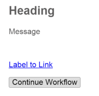
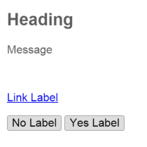
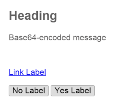
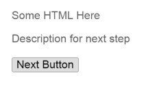

# DFKI's utility services

The utility services offer simple but useful tools in the form of web services, which can easily be integrated into workflows.

The [Continue](#continue) and [ShowHtml](#showhtml) services may be used to display a (html) message to the user during the workflow. If you'd like to integrate an external webpage into a workflow, feel free to use the [IFrameDisplay](#iframedisplay).
The [Decision](#decision) and [Custom_Decision](#custom_decision) services can be used to interact via a simple Yes/No-form with the user.
To request text input from the user, one can make use of the [StringInput](#stringinput) service. If you ever need a unique input, have a look at the [UniqueString](#uniquestring) service.


Some of the services presented below return a parameter "status_base64". Usually, this output does not need to be connected to the remaining workflow as it merely appears for technical reasons.
The input "sessionToken" has to be connected to the respective workflow input and is mandatory. The input "serviceID" is also mandatory but will automatically be provided by the execution engine, therefore it does not need to be connected.

---

## Continue

Service URI: `http://www.caxman.eu/apps/dfki/showCustomDecisionHtml.owl#showCustomDecisionHtml_Service`

The Continue-Service can be used to display a message to the user during the execution of the workflow.

To continue the execution of the workflow, the user has to click on the displayed button.

Optionally, a link can be displayed to redirect the user to an external location.

### Example



### Inputs

| Parameter name | Description |
--- | :--- |
| `sessionToken` | Session token to be used throughout the workflow |
| `serviceID` | The ID assigned to this service by the executione engine, provided automatically |
| `message` | The message to be presented to the user |
| `heading` | The title of the message |
| `linkLabel` | The title of the optional link |
| `linkValue` | The value of the optional link |
| `extraParameters` | Needs to be connected to the "extraParameters" workflow input |

### Outputs
| Parameter name  | Description |
--- | :--- |
| `status_base64` | Base64-encoded HTML page with continue button |


---
## Decision

Service URI: `http://www.caxman.eu/apps/dfki/showDecisionHtml.owl#showDecisionHtml_Service`

The Decision-Service can be used to create a simple Yes/No-form, to interact with the user.

Optionally, a link can be displayed to redirect the user to an external location.

### Example



### Inputs
| Parameter name | Description |
--- | :--- |
| `sessionToken` | Session token to be used throughout the workflow |
| `serviceID` | The ID assigned to this service by the executione engine, provided automatically |
| `message` | The message to be presented to the user |
| `heading` | The title of the message |
| `linkLabel` | The title of the optional link |
| `linkValue` | The value of the optional link |
| `buttonYesLabel` | Label of the button which sends `true` as a result |
| `buttonNoLabel` | Label of the button which sends `false` as a result |
| `extraParameters` | Needs to be connected to the "extraParameters" workflow input |

### Outputs
| Parameter name  | Description |
--- | :--- |
| `status_base64` | Base64-encoded HTML page with two buttons |
| `decision` | The coice of the user, either `true` or `false` | 

---
## Custom_Decision

Service URI: `http://www.caxman.eu/apps/dfki/showCustomDecisionHtml.owl#showCustomDecisionHtml_Service`

The Custom_Decision-Service can be used to create a simple Yes/No-form, to interact with the user.
Unlike the Decision-Service, one can provide a base64-encoded message, potentially including HTML code.

Optionally, a link can be displayed to redirect the user to an external location.

### Example



### Inputs
| Parameter name | Description |
--- | :--- |
| `sessionToken` | Session token to be used throughout the workflow |
| `serviceID` |  The ID assigned to this service by the executione engine, provided automatically |
| `message_base64` | The base64-encoded message to be presented to the user |
| `heading` | The title of the message |
| `linkLabel` | The title of the optional link |
| `linkValue` | The value of the optional link |
| `buttonYesLabel` | Label of the button which sends `true` as a result |
| `buttonNoLabel` | Label of the button which sends `false` as a result |
| `extraParameters` | Needs to be connected to the "extraParameters" workflow input |


### Outputs
| Parameter name  | Description |
--- | :--- |
| `status_base64` | Base64-encoded HTML page with two buttons |
| `decision` | The coice of the user, either `true` or `false` | 

---
## ShowHtml

### Example



Service URI: `http://www.caxman.eu/apps/dfki/showHtml.owl#showHtml_Service`

The showHtml-Service can be used to display a html-encoded message to the user during the execution of the workflow.

To continue the execution of the workflow, the user has to click the displayed button.

Optionally, a link can be displayed to redirect the user to an external location.

### Inputs
| Parameter name | Description |
--- | :--- |
| `sessionToken` | Session token to be used throughout the workflow |
| `serviceID` | The ID assigned to this service by the executione engine, provided automatically |
| `pageBody_base64` | Base64-encoded HTML body to be displayed to the user |
| `nextButtonLabel` | Label of the button which continues the workflow |
| `nextDescription` | Additional message, displayed above the button which continues the workflow |
| `extraParameters` | Needs to be connected to the "extraParameters" workflow input |


### Outputs
| Parameter name  | Description |
--- | :--- |
| `status_base64` | Base64-encoded HTML page displaying the provided HTML code and a button to continue the workflow |

---
## StringInput

Service URI: `http://www.caxman.eu/apps/dfki/StringInput.owl#showStringInputHtml_Service`

If the user needs to provide an input, one can make use of the StringInput-Service.

To submit the input and to continue the workflow the user has to click on the "OK"-button.

### Example


### Inputs
| Parameter name | Description |
--- | :--- |
| `sessionToken` | Session token to be used throughout the workflow |
| `serviceID` | The ID assigned to this service by the executione engine, provided automatically |
| `message` | Message to be presented above the input field |
| `heading` | Title of the web page |
| `extraParameters` | Needs to be connected to the "extraParameters" workflow input |

### Outputs
| Parameter name  | Description |
--- | :--- |
| `status_base64` | Base64-encoded HTML page with an input field |
| `userString` | The string provided by the user through the input field | 

---
## UniqueString

Service URI: `http://www.caxman.eu/apps/dfki/uniqueString.owl#uniqueString_Service`

If you ever need a unique string input, make use of the UniqueString-Service.

Given a prefix string and a number this service returns a concatenation of those, concatenated with the current time in milliseconds (UNIX).

### Inputs
| Parameter name | Description |
--- | :--- |
| `prefix` | A string prefix for the generated string |
| `number` | An additional integer prefix for the generated string |


### Outputs
| Parameter name  | Description |
--- | :--- |
| `unique` | A unique string created using the following pattern: prefix-number-currentmillis |

### Example output
`test-123-1523950990924`

Remark: If either the prefix or the number input are not provided the respective part of the output string will be left empty, for example:
`test--1523950990924`

---
## IFrameDisplay

Service URI: `http://www.caxman.eu/apps/dfki/IframeDisplay.owl#displayHtml_Service`

The IframeDisplay-Service can be used to show an external HTML page during the execution of the workflow.

To continue the workflow, the external HTML has to perform a SOAP call to the workflow editor, for example when the user clicks on a button "Next".
The javascript variables `WFM`, `ServiceID` and `sessionToken` are accessible from within the iframe and provide the necessary information.
The address location of the workflow manager is provided through the `WFM` variable, whereas `sessionToken` and `serviceID` have to be passed as arguments to the workflow manager's SOAP function `serviceExecutionFinished`.

Code snippet of such an externally hosted HTML:

```html
<html><head><title>SOAP request tester</title>
<link rel="stylesheet" type="text/css" href="https://api.hetcomp.org/portal/twopointo/styles/style.css">
<script type="text/javascript">
var objXMLHttpRequest = CreateXMLHttpRequest();
function CreateXMLHttpRequest() {
	if (typeof XMLHttpRequest != "undefined") {
  return new XMLHttpRequest();
 } else if (typeof ActiveXObject != "undefined") {
  return new ActiveXObject("Microsoft.XMLHTTP");
 } else {
  throw new Error("XMLHttpRequest not supported");
 }
}
function cont_wf() {
 objXMLHttpRequest.open("POST", parent.WFM, false);
 objXMLHttpRequest.setRequestHeader("Content-Type", "text/xml");
 objXMLHttpRequest.setRequestHeader("SOAPAction", "\"\"");
 var request_body = '<soapenv:Envelope xmlns:soapenv=\"http://schemas.xmlsoap.org/soap/envelope/\" xmlns:wor=\"http://www.eu-cloudflow.eu/dfki/WorkflowManager2/\">' +
' <soapenv:Header />' +
' <soapenv:Body>' +
'  <wor:serviceExecutionFinished>' +
'   <serviceID>' + parent.serviceID + '</serviceID>' +
'   <sessionToken>' + parent.sessionToken + '</sessionToken>' +
'   <xmlOutputs_base64>PFNlcnZpY2VPdXRwdXRzPjxzdGF0dXNfYmFzZTY0PmRYTmxjaUJqYjI1MGFXNTFaV1E9PC9zdGF0dXNfYmFzZTY0PjwvU2VydmljZU91dHB1dHM+</xmlOutputs_base64>' +
'  </wor:serviceExecutionFinished>' +
' </soapenv:Body>' +
'</soapenv:Envelope>';
	try {
  objXMLHttpRequest.send(request_body);
 } catch (exception) {
  alert(exception);
 }
}
</script></head><body>
<div style="padding:30px;">
<h2>This is a SOAP test.</h2>
<p style="width:400px;">Please click to continue</p><br />
<input type="button" value="Send 'finishedExecution'" onclick="cont_wf()" />
</div></body></html>
```

### Inputs
| Parameter name | Description |
--- | :--- |
| `sessionToken` | Session token to be used throughout the workflow |
| `serviceID` | The ID assigned to this service by the executione engine, provided automatically |
| `pageTitle` | Not yet used |
| `url` | URL to be queried for web content |
| `extraParameters` | Needs to be connected to the "extraParameters" workflow input |


### Outputs
| Parameter name  | Description |
--- | :--- |
| `status_base64` | Base64-encoded HTML page with an iframe embedding the defined HTML page |

---
## EndIfService

Service URI: `http://www.caxman.eu/sync/DFKI/EndIf.owl#EndIf_Service`

This service is not to be used individually, as it is part of the branching framework.